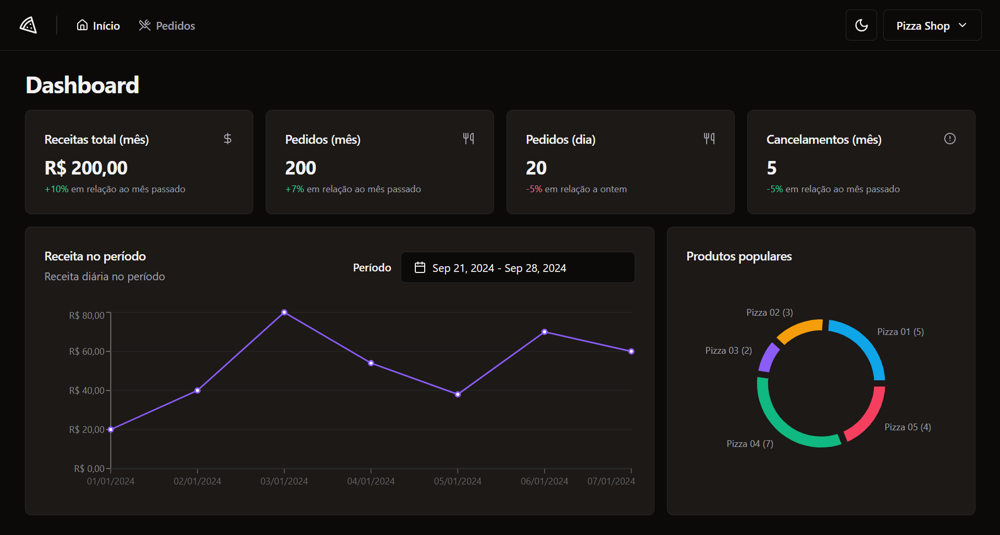

# Pizzashop Ignite App



## Technologies

- `React.js`
- `TypeScript`
- `Radix-UI`
- `Shadcn-UI`
- `Skeleton`
- `Tailwindcss`
- `React-Router-Dom`
- `React-Hook-Form`
- `Zod`
- `Recharts`
- `Playwright`
- `Testing-Library`
- `Vitest`

## Installation

```bash
# Clone repository
$ https://github.com/EmanuelQuintino/Pizzashop-Ignite-App.git

# Install dependencies
$ npm install

# Run project
$ npm run dev
```
